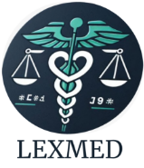
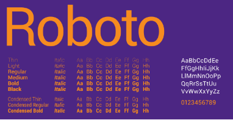
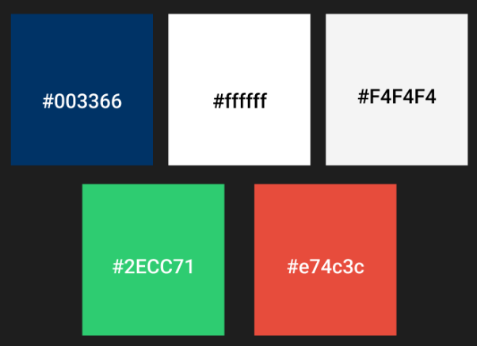
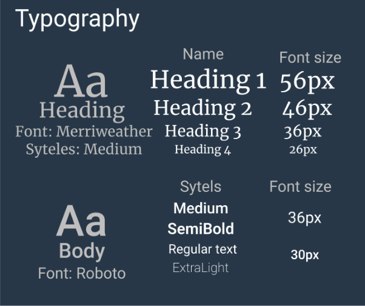
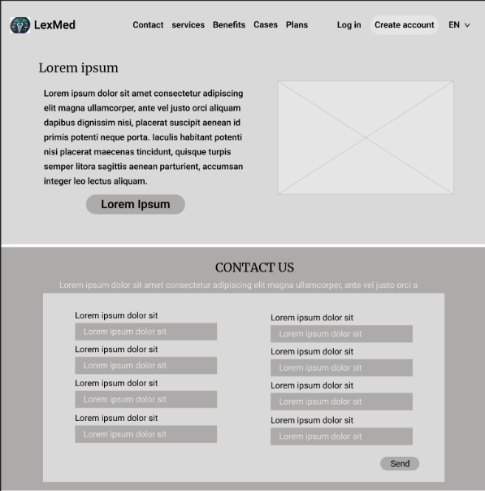
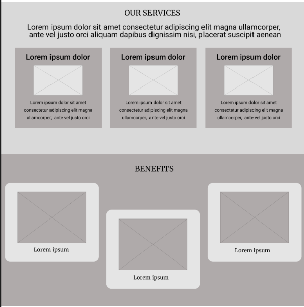
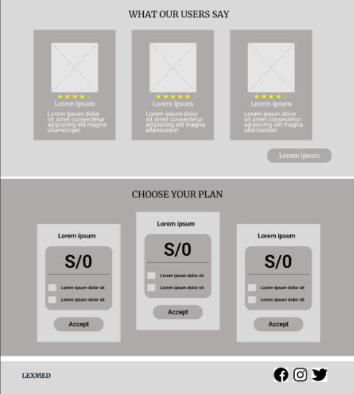

# Capítulo IV: Product Design 
## 4.1. Style Guidelines.
Con base en los principios de diseño de LexMed, las "guías de estilo" describen los procedimientos para redactar, diseñar o presentar documentos, contenido web, software u otros trabajos creativos, describiendo parámetros esenciales como la identidad de marca, la paleta de colores, la tipografía. 
## 4.1.1. General Style Guidelines. 
**Branding:**

LexMed representa la confianza, especialización y empoderamiento tanto de abogados como de médicos. Proporcionamos una serie de servicios y herramientas diseñadas para facilitar la conexión y colaboración entre abogados especializados en derecho médico y médicos que enfrentan problemas legales.

**Logotipo:** 

La elección del logotipo de LEXMed se basa en la necesidad de comunicar claramente la misión y los valores fundamentales de la plataforma, que se centra en la intersección entre la medicina y el derecho.

- Caduceo Médico: Este símbolo es ampliamente reconocido en todo el mundo como un emblema de la medicina. Al colocar el caduceo en el centro del logotipo, destacamos nuestro compromiso principal con los profesionales de la salud y la importancia de brindarles el apoyo necesario en asuntos legales.
- Balanza de la Justicia: La balanza es un símbolo universal de justicia, equidad y legalidad. Su inclusión en el logotipo enfatiza la esencia legal de LEXMed, que busca ofrecer a los médicos una representación justa y especializada en casos de mala praxis o negligencia.
- Integración del Corazón: El corazón entrelazado con el caduceo sugiere que la plataforma no solo se basa en la técnica y el conocimiento, sino también en la ética, la empatía y el cuidado. Esto refleja la misión de LEXMed de proteger tanto los derechos de los médicos como los intereses de los pacientes, siempre con un enfoque humanizado.
- Colores y Estética: Los colores utilizados en el logotipo, predominantemente verde y blanco, están asociados con la salud, la pureza y la tranquilidad. Estos colores refuerzan la imagen de LEXMed como una plataforma confiable, ética y dedicada al bienestar de sus usuarios.

En conjunto, este logotipo no solo es una representación visual atractiva, sino que también encapsula la esencia de lo que LEXMed representa: la unión armoniosa entre la medicina y el derecho para asegurar que se haga justicia con integridad y profesionalismo.

  

**Tipografías:** 

Para garantizar una combinación de modernidad y profesionalismo, hemos seleccionado cuidadosamente las fuentes tipográficas para la plataforma. Optamos por Merriweather para los títulos, debido a su elegancia y claridad, y Roboto.   Esta combinación asegura una legibilidad óptima y una coherencia visual que refuerza la identidad profesional de la plataforma.

**Merriweather:** 

  

*Figura 1: imagen extraída de esccooltext* 

**Roboto:**

  

*Figura 2: imagen extraída de University of Evansille*

**Paleta de Colores**: 

La selección de la paleta de colores para "LexMed" se basa en principios estratégicos que refuerzan la identidad visual y funcionalidad de la plataforma:

- Azul Marino (#003366): Representa confianza y profesionalismo. Usar para encabezados, barras de navegación y botones de acción principales.
- Blanco (#ffffff): Fondo principal para mantener claridad y enfoque en el contenido.
- Gris Claro (#F4F4F4): Para fondos secundarios y secciones con menor importancia.
- Verde Esmeralda (#2ECC71): Para indicar acciones positivas, confirmaciones y éxito.
- Rojo (#e74c3c): Asociado con advertencias y situaciones críticas, se reserva para resaltar errores y alertas.

` `En conjunto, estos colores no solo cumplen funciones estéticas, sino que también juegan un papel crucial en la usabilidad y experiencia del usuario, asegurando que la plataforma "LexMed" sea intuitiva, confiable y efectiva.

  

*Figura 2: imagen extraída de Figma*

## 4.1.2. Web Style Guidelines.
**Fuentes:**  Se usó Merriweather  y hemos incorporado cuatro variaciones de Roboto 

Para los heading se uno Merriweather con el estilo Médium y para el cuerpo se usó Roboto con  4 estilos (Medium, SemiBold, Regular, y ExtraLight). 

  

**colores:** Se usan los colores según especificado en el apartado “General Style Guidelines” 

  

**Enlaces y botones:** Los botones primarios estarán con un fondo azul marino y texto blanco, con un borde redondeado de 5px.

**Pantallas emergentes:** Tienen el objetivo de confirmar las acciones clave del funcionamiento de la app.

**Estilo de Imágenes y Gráficos:** Todas las imágenes deben tener una resolución mínima de 72px.

**Espaciado y Márgenes:** Márgenes de 20px entre secciones principales y 10px entre componentes individuales.

**Formulario y Campos de entrada:** Los formularios se utilizan para el registro de entrada.

**Tablas:**  Cuentan con  los colores rojos y verdes, cada fila representa un caso y cada columna la información del abogado o médico.**  	

##  4.2. Information Architecture.
La arquitectura de la información es el fundamento de la experiencia de usuario en LEXMed. Esta sección define cómo se organiza, etiqueta y navega el contenido del sitio web, garantizando que los usuarios puedan acceder rápidamente a la información que necesitan de manera intuitiva.
##  4.2.1. Organization Systems.
l sistema de organización en LEXMed está cuidadosamente diseñado para estructurar el contenido de manera lógica y accesible, garantizando que los usuarios puedan navegar y localizar los recursos relevantes con facilidad. Para lograrlo, se establece una j**erarquía clara** en la que todo el contenido se organiza en una estructura bien definida. Las secciones principales, como "Inicio", "Servicios", "Para Médicos", "Para Abogados", "Casos", "Recursos", y "Planes y Precios", se presentan de manera destacada y son accesibles directamente desde el menú principal.

La categorización del contenido es otro aspecto fundamental del sistema. Los materiales se agrupan en categorías coherentes para facilitar la búsqueda. Por ejemplo, la sección de **"Servicios"** ofrece un desglose detallado de los servicios disponibles tanto para médicos como para abogados, mientras que la sección de **"Casos"** organiza los casos según la especialidad médica o el tipo de problema legal. Además, la sección de **"Recursos**" reúne documentación y guías legales, artículos de interés y preguntas frecuentes, proporcionando a los usuarios un acceso rápido a la información que necesitan. Por último, **"Planes y Precios"** es una sección específica que detalla las opciones de suscripción, comparando los beneficios y precios de las opciones:

- Basic: El abogado tiene acceso a un máximo de 20 médicos para referir su caso.
- Silver: El abogado puede acceder a hasta 50 médicos para referir su caso.
- Gold: El abogado tiene acceso ilimitado a todos los médicos disponibles, pudiendo elegir libremente a quién referir su caso.

El sistema también está diseñado para ser adaptable, permitiendo la adición de nuevas categorías o subcategorías sin comprometer la estructura existente. Esto asegura que la plataforma pueda evolucionar y expandirse según las necesidades de los usuarios, manteniendo siempre una organización clara y eficiente.
##  4.2.2. Labeling Systems.
LEXMed utiliza un sistema de etiquetado claro y consistente para garantizar que los usuarios puedan encontrar lo que buscan sin confusión.

|Etiqueta|Definición |
| :-: | :-: |
|Contact|Etiqueta utilizada para identificar la información de contacto de los doctores y abogados involucrados en un caso. Facilita la comunicación directa y rápida entre las partes interesadas.|
|Priority|Etiqueta que indica el nivel de urgencia de un caso, permitiendo a los usuarios enfocar sus esfuerzos en los asuntos más críticos y urgentes primero.|
|Recent Cases|Etiqueta que marca los casos más recientemente añadidos o actualizados en la plataforma.|
|Medical Specialty|Etiqueta utilizada para clasificar los casos según la especialidad médica involucrada, como cardiología, cirugía, pediatría, etc. |
|Case Status|Etiqueta que indica el estado actual del caso, como "Abierto", "En Proceso", "Resuelto" o "Archivado".|
|Advisory Type|Etiqueta que clasifica el tipo de asesoría legal requerida, como "Defensa", "Consulta", "Negociación", o "Mediación". |

##  4.2.3. SEO Tags and Meta Tags 
Las etiquetas de SEO y meta tags son esenciales para asegurar que el contenido de LEXMed sea fácilmente descubierto por los motores de búsqueda, mejorando la visibilidad y el tráfico al sitio.

Titulo: 

Lading page:

Web Aplication: 

## 4.2.4. Searching Systems. 
En el Searching Systems de la plataforma LexMed, se prioriza la facilidad de uso y la precisión en la búsqueda de información relevante para los usuarios. El sistema de búsqueda está diseñado para que los abogados  puedan localizar rápidamente casos, perfiles profesionales, y documentos importantes. La búsqueda se realiza a través de un motor avanzado que permite filtrar resultados por categorías como especialidad médica, gravedad del caso, prioridad, y fecha de reciente actividad.

Este sistema también integra sugerencias automáticas y resultados en tiempo real a medida que los usuarios escriben, lo que facilita la localización de la información antes de finalizar la consulta. Además, se incluye la opción de búsqueda avanzada para usuarios que necesitan realizar consultas más específicas, como encontrar abogados con experiencia en casos similares o filtrar casos según su estado actual.

## 4.2.5. Navigation Systems. 
Los sistemas de navegación en LEXMed están diseñados para ser intuitivos y permitir a los usuarios moverse fácilmente entre las diferentes secciones del sitio.

- **Menú Principal:**
  - Un menú de navegación claro y accesible en la parte superior de cada página.
  - Ejemplo: "Inicio", "Servicios", "Casos", "Contacto", "Testimonios", "Mi Cuenta".
- **Breadcrumbs (Migas de Pan):**
  - Indica la ubicación del usuario dentro del sitio y permite retroceder fácilmente.
  - Ejemplo: "Inicio > Servicios > Asesoría Legal > Mala Praxis".
- **Enlaces Internos:**
  - Enlaces dentro del contenido que faciliten la navegación entre secciones relacionadas.
  - Ejemplo: En una página sobre "Mala Praxis", incluir un enlace directo a "Contactar a un Abogado".

Este enfoque integral garantizará que LEXMed ofrezca una experiencia de usuario óptima, alineada con las mejores prácticas de diseño y usabilidad

## 4.3. Landing Page UI Design. 
## 4.3.1. Landing Page Wireframe.

  
  
  

##  4.3.2. Landing Page Mock-up. 
## 4.4. Web Applications UX/UI Design. 
## 4.4.1. Web Applications Wireframes. 
## 4.4.2. Web Applications Wireflow Diagrams. 
## 4.4.2. Web Applications Mock-ups. 
## 4.4.3. Web Applications User Flow Diagrams. 
## 4.5. Web Applications Prototyping. 
## 4.6. Domain-Driven Software Architecture. 
## 4.6.1. Software Architecture Context Diagram. 
## 4.6.2. Software Architecture Container Diagrams.
##  4.6.3. Software Architecture Components Diagrams. 
## 4.7. Software Object-Oriented Design. 
## 4.7.1. Class Diagrams. 
## 4.7.2. Class Dictionary. 
## 4.8. Database Design. 
## 4.8.1. Database Diagram.